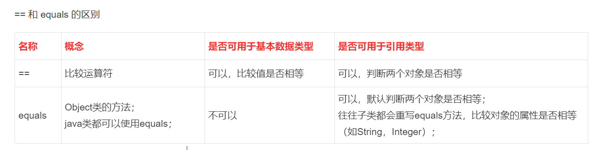

# Java基础知识
## 一、JDK、JRE、JVM之间的关系
    JDK = JRE  + java开发工具
    JRE = JVM  + 核心类库

## 二、java编写7个规范
    1. 类、方法的注释，使用javadoc注释，即文档注释
    2. 非javadoc注释，对代码说明，说明如何修改，注意事项
    3. 使用tab，整体将代码右移，shift+tab，整体将代码向左移动
    4. 运算符和 = 两边给空格
    5. 源码文件用 utf-8 编码
    6.行宽字符不超过 80 
    7. 行尾风格和次行风格（推荐）

## 三、浮点数在机器中的存放形式
    1. 浮点数=符号位+指数位+尾数位
    2. 尾数部分可能丢失造成精度损失

## 四、基本数据类型转换
    1. 自动类型转换
        java程序在进行赋值或者运算时，精度小的类型自动转换为精度大的数据类型。
        char  ->  int   ->  long  ->  float  ->  double
        byte  ->  short  ->  int  ->  long  ->  float  ->  double
    2. 强制类型转换
    自动类型转换的逆过程，将容量大的数据类型转换为容量小的数据类型。使用时加上强制转换符（），但可能造成精度降低或溢出。
        1)当进行数据的大小从大->小，就需要使用到强制转换
        2)强转符号只针对最近的操作数有效，往往会使用小括号提升优先级
        3)char类型可以保存int的常量值，但不能保存int的变量值，需要强转
        4)byte和short类型在进行运算时，当做int类型处理

## 五、算术运算符-模除的公式
    ！！！ 重点
    %的本质为   a%b = a - a / b * b
    
    -10 % 3  =  -10 - (-10) / 3 *3 =  -1
    10 % -3  =  10 - 10 / (-3) * (-3) =  1
    -10 % -3  =  -10 - (-10) / (-3) * (-3) =  -1
### ->>算数运算符面试题
    1.题目一
         int  i=1;
         i=i++;  //规则使用临时变量
         System.out.println(i);//结果为1
        问：结果是多少？为什么？
        (1) temp =i   //temp =1
        (2) i = i+1	//i =2
        (3)i = temp	//i=1
        
    2.题目二
        int i=1;
        i=++i; //规则使用临时变量
         System.out.println(i);  //结果为2
        (1) i = i+1	//i =2
        (2) temp =i   //temp =2
        (3) i = temp	 //i=2
    
## 六、原码、反码、补码
    1. 二进制的最高位是符号位：0表示正数，1表示负数（口诀：0->0，1->-）
    2. 正数的原码、反码、补码都是一样的（三码合一）
    3. 负数的反码 = 它的原码符号位不变，其它位取反（0->1，1->0）
    4. 负数的补码 = 它的反码 + 1，负数的反码 = 它的补码 - 1
    5. 0 的反码，补码都是0
    6. java没有无符号数，换言之，java中的数都是有符号的
    7. 在计算机运算的时候，都是以补码的方式来运算的
    8. 当我们看运算结果的时候，要看它的原码

## 七、Switch结构的细节
    细节1
    1）表达式数据类型，应该和case 后的常量类型一致；
    2）或者是可以自动转换成相互比较的类型，比如输入的是字符，而case 常量是int
    
    细节2
    Switch（表达式）中表达式的返回值必须是 （byte，short，int，char，enum[枚举]，String）
    
    细节3
    case 字句中的值必须是常量（1，'a'）或常量表达式，而不能是变量
    
    细节4
    default子句是可选的，当没有匹配的case时，执行default
    如果没有default子句，又没有匹配任何常量，则没有任何输出
    
    细节5
    break语句用来在执行完一个case分支后使程序跳出switch语句块；
    如果没有写break，程序会顺序执行到switch结尾，除非遇到break

## 八、== 和 equals 的区别
     
    